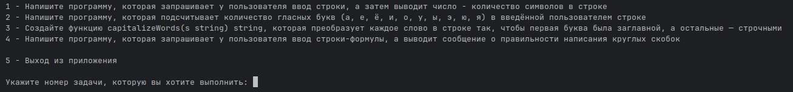
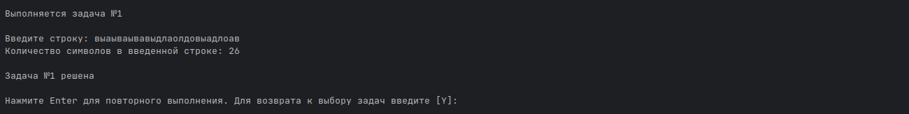

# Приложение для решения четырех задач по теме 1.5

Условия задач находится в файле [TASK.md][task]

## Описание работы приложения

Приложение запускается через main.go

После запуска предлагается выбрать задачу для решения или выйти из приложения

Номера задач соответствуют номерам указаным в задании

После этого приложение переходит к решению конкретной задачи

И предлагает ввести данные для обработки

После чего выполняет, необходимые для решения задачи, действия и выводит результат обработки 

И предлагает: либо повторить выполнение задачи, либо вернуться к выбору задач

[task]: TASK.md "Задание по теме 1.5"